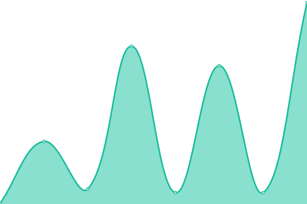

# [📈 Live Status](https://skypack.dev): <!--live status--> **🟧 Partial outage**

This repository contains the open-source uptime monitor and status page for [azu](https://efcl.info/), powered by [Upptime](https://github.com/upptime/upptime).

With [Upptime](https://upptime.js.org), you can get your own unlimited and free uptime monitor and status page, powered entirely by a GitHub repository. We use [Issues](https://github.com/azu/skypack-upptime/issues) as incident reports, [Actions](https://github.com/azu/skypack-upptime/actions) as uptime monitors, and [Pages](https://skypack.dev) for the status page.

<!--start: status pages-->
<!-- This summary is generated by Upptime (https://github.com/upptime/upptime) -->
<!-- Do not edit this manually, your changes will be overwritten -->
<!-- prettier-ignore -->
| URL | Status | History | Response Time | Uptime |
| --- | ------ | ------- | ------------- | ------ |
|  [skypack.dev](https://www.skypack.dev/) | 🟩 Up | [skypack-dev.yml](https://github.com/azu/skypack-upptime/commits/HEAD/history/skypack-dev.yml) | 

 152ms
     
 | 

<a href="https://azu.github.io/skypack-upptime/history/skypack-dev">100.00%</a>
    

|  [cdn.skypack.dev](https://cdn.skypack.dev/canvas-confetti) | 🟩 Up | [cdn-skypack-dev.yml](https://github.com/azu/skypack-upptime/commits/HEAD/history/cdn-skypack-dev.yml) | 

 256ms
     
 | 

<a href="https://azu.github.io/skypack-upptime/history/cdn-skypack-dev">100.00%</a>
    

|  [status.skypack.dev](https://status.skypack.dev/) | 🟥 Down | [status-skypack-dev.yml](https://github.com/azu/skypack-upptime/commits/HEAD/history/status-skypack-dev.yml) | 

 261ms
     
 | 

<a href="https://azu.github.io/skypack-upptime/history/status-skypack-dev">0.00%</a>
    

|  [Test Preact](https://cdn.skypack.dev/preact@10) | 🟩 Up | [test-preact.yml](https://github.com/azu/skypack-upptime/commits/HEAD/history/test-preact.yml) | 

 204ms
     
 | 

<a href="https://azu.github.io/skypack-upptime/history/test-preact">100.00%</a>
    

<!--end: status pages-->

[**Visit our status website →**](https://skypack.dev)

## 📄 License

- Powered by: [Upptime](https://github.com/upptime/upptime)
- Code: [MIT](./LICENSE) © [azu](https://efcl.info/)
- Data in the `./history` directory: [Open Database License](https://opendatacommons.org/licenses/odbl/1-0/)
