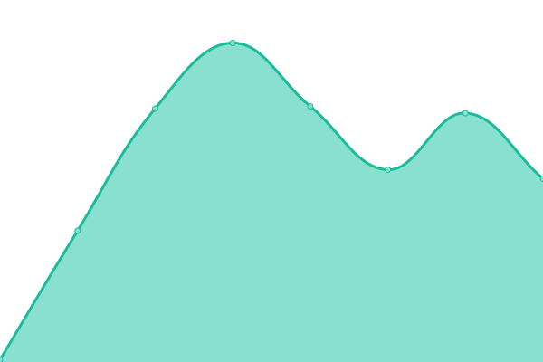
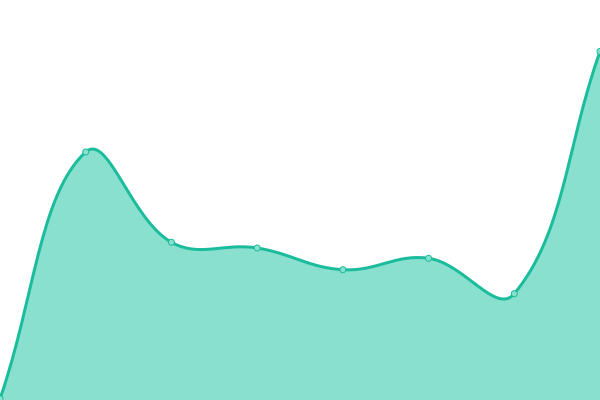

# [📈 Live Status](https://azu.github.io/npmcdn-upptime/): <!--live status--> **🟧 Partial outage**

This repository contains the open-source uptime monitor and status page for [azu](https://efcl.info/), powered by [Upptime](https://github.com/upptime/upptime).

With [Upptime](https://upptime.js.org), you can get your own unlimited and free uptime monitor and status page, powered entirely by a GitHub repository. We use [Issues](https://github.com/azu/skypack-upptime/issues) as incident reports, [Actions](https://github.com/azu/skypack-upptime/actions) as uptime monitors, and [Pages](https://skypack.dev) for the status page.

<!--start: status pages-->
<!-- This summary is generated by Upptime (https://github.com/upptime/upptime) -->
<!-- Do not edit this manually, your changes will be overwritten -->
<!-- prettier-ignore -->
| URL | Status | History | Response Time | Uptime |
| --- | ------ | ------- | ------------- | ------ |
|  [skypack.dev](https://www.skypack.dev/) | 🟩 Up | [skypack-dev.yml](https://github.com/azu/npmcdn-upptime/commits/HEAD/history/skypack-dev.yml) | 

 271ms
     
 | 

<a href="https://azu.github.io/npmcdn-upptime/history/skypack-dev">100.00%</a>
    

|  [cdn.skypack.dev](https://cdn.skypack.dev/canvas-confetti) | 🟩 Up | [cdn-skypack-dev.yml](https://github.com/azu/npmcdn-upptime/commits/HEAD/history/cdn-skypack-dev.yml) | 

 134ms
     
 | 

<a href="https://azu.github.io/npmcdn-upptime/history/cdn-skypack-dev">100.00%</a>
    

|  [status.skypack.dev](https://status.skypack.dev/) | 🟥 Down | [status-skypack-dev.yml](https://github.com/azu/npmcdn-upptime/commits/HEAD/history/status-skypack-dev.yml) | 

 322ms
     
 | 

<a href="https://azu.github.io/npmcdn-upptime/history/status-skypack-dev">0.00%</a>
    

|  [cdn.skypack.dev/{pkg}@{pin}](https://cdn.skypack.dev/preact@10.5.5) | 🟩 Up | [cdn-skypack-dev-pkg-pin.yml](https://github.com/azu/npmcdn-upptime/commits/HEAD/history/cdn-skypack-dev-pkg-pin.yml) | 

 345ms
     
 | 

<a href="https://azu.github.io/npmcdn-upptime/history/cdn-skypack-dev-pkg-pin">100.00%</a>
    

|  [cdn.skypack.dev/{pkg}@{major}](https://cdn.skypack.dev/preact@10) | 🟩 Up | [cdn-skypack-dev-pkg-major.yml](https://github.com/azu/npmcdn-upptime/commits/HEAD/history/cdn-skypack-dev-pkg-major.yml) | 

 296ms
     
 | 

<a href="https://azu.github.io/npmcdn-upptime/history/cdn-skypack-dev-pkg-major">100.00%</a>
    

|  [cdn.skypack.dev/{pkg}@^{semver}](https://cdn.skypack.dev/preact@^10) | 🟩 Up | [cdn-skypack-dev-pkg-semver.yml](https://github.com/azu/npmcdn-upptime/commits/HEAD/history/cdn-skypack-dev-pkg-semver.yml) | 

 291ms
     
 | 

<a href="https://azu.github.io/npmcdn-upptime/history/cdn-skypack-dev-pkg-semver">100.00%</a>
    

|  [unpkg.com](https://unpkg.com/) | 🟩 Up | [unpkg-com.yml](https://github.com/azu/npmcdn-upptime/commits/HEAD/history/unpkg-com.yml) | 

 61ms
     
 | 

<a href="https://azu.github.io/npmcdn-upptime/history/unpkg-com">100.00%</a>
    

|  [unpkg.com/{pkg}](https://unpkg.com/preact) | 🟩 Up | [unpkg-com-pkg.yml](https://github.com/azu/npmcdn-upptime/commits/HEAD/history/unpkg-com-pkg.yml) | 

 169ms
     
 | 

<a href="https://azu.github.io/npmcdn-upptime/history/unpkg-com-pkg">56.89%</a>
    

|  [unpkg.com/{pkg}@{pin}](https://unpkg.com/preact@10.5.5) | 🟩 Up | [unpkg-com-pkg-pin.yml](https://github.com/azu/npmcdn-upptime/commits/HEAD/history/unpkg-com-pkg-pin.yml) | 

 32ms
     
 | 

<a href="https://azu.github.io/npmcdn-upptime/history/unpkg-com-pkg-pin">57.96%</a>
    

|  [unpkg.com/{pkg}@{major}](https://unpkg.com/preact@10) | 🟩 Up | [unpkg-com-pkg-major.yml](https://github.com/azu/npmcdn-upptime/commits/HEAD/history/unpkg-com-pkg-major.yml) | 

 67ms
     
 | 

<a href="https://azu.github.io/npmcdn-upptime/history/unpkg-com-pkg-major">57.03%</a>
    

|  [unpkg.com/{pkg}@^{semver}](https://unpkg.com/preact@^10) | 🟩 Up | [unpkg-com-pkg-semver.yml](https://github.com/azu/npmcdn-upptime/commits/HEAD/history/unpkg-com-pkg-semver.yml) | 

 309ms
     
 | 

<a href="https://azu.github.io/npmcdn-upptime/history/unpkg-com-pkg-semver">57.11%</a>
    

|  [esm.sh](https://esm.sh/) | 🟩 Up | [esm-sh.yml](https://github.com/azu/npmcdn-upptime/commits/HEAD/history/esm-sh.yml) | 

 269ms
     
 | 

<a href="https://azu.github.io/npmcdn-upptime/history/esm-sh">100.00%</a>
    

|  [esm.sh status page](https://esm.instatus.com/) | 🟩 Up | [esm-sh-status-page.yml](https://github.com/azu/npmcdn-upptime/commits/HEAD/history/esm-sh-status-page.yml) | 

 510ms
     
 | 

<a href="https://azu.github.io/npmcdn-upptime/history/esm-sh-status-page">100.00%</a>
    

|  [esm.sh/{pkg}](https://esm.sh/preact) | 🟩 Up | [esm-sh-pkg.yml](https://github.com/azu/npmcdn-upptime/commits/HEAD/history/esm-sh-pkg.yml) | 

 166ms
     
 | 

<a href="https://azu.github.io/npmcdn-upptime/history/esm-sh-pkg">100.00%</a>
    

|  [esm.sh/{pkg}@{pin}](https://esm.sh/preact@10.5.5) | 🟩 Up | [esm-sh-pkg-pin.yml](https://github.com/azu/npmcdn-upptime/commits/HEAD/history/esm-sh-pkg-pin.yml) | 

 89ms
     
 | 

<a href="https://azu.github.io/npmcdn-upptime/history/esm-sh-pkg-pin">100.00%</a>
    

|  [esm.sh/{pkg}@{major}](https://esm.sh/preact@10) | 🟩 Up | [esm-sh-pkg-major.yml](https://github.com/azu/npmcdn-upptime/commits/HEAD/history/esm-sh-pkg-major.yml) | 

 150ms
     
 | 

<a href="https://azu.github.io/npmcdn-upptime/history/esm-sh-pkg-major">100.00%</a>
    

|  [esm.sh/{pkg}@^{semver}](https://esm.sh/preact@^10) | 🟩 Up | [esm-sh-pkg-semver.yml](https://github.com/azu/npmcdn-upptime/commits/HEAD/history/esm-sh-pkg-semver.yml) | 

 84ms
     
 | 

<a href="https://azu.github.io/npmcdn-upptime/history/esm-sh-pkg-semver">100.00%</a>
    

<!--end: status pages-->

[**Visit our status website →**](https://azu.github.io/npmcdn-upptime/)

## 📄 License

- Powered by: [Upptime](https://github.com/upptime/upptime)
- Code: [MIT](./LICENSE) © [azu](https://efcl.info/)
- Data in the `./history` directory: [Open Database License](https://opendatacommons.org/licenses/odbl/1-0/)
